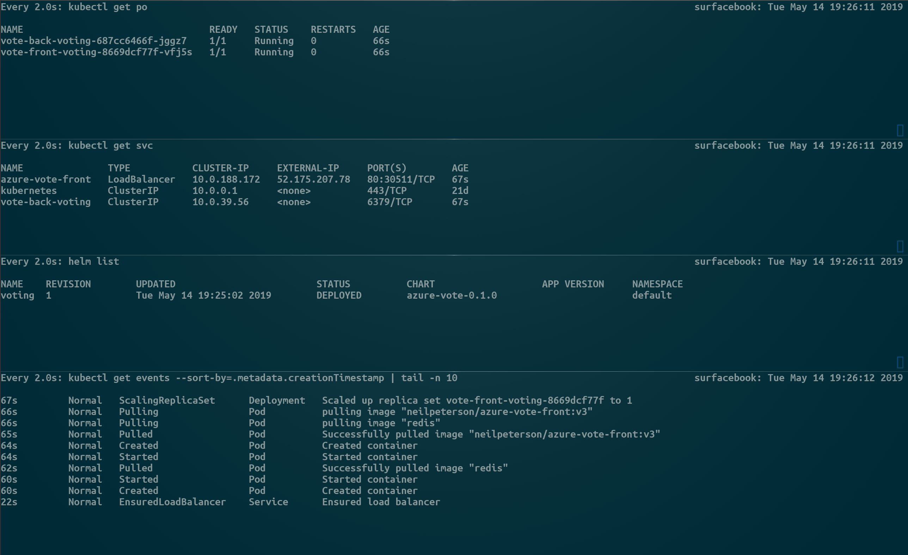

# Installing and using Helm 2 

This directory helps you install and use Helm 2 in a basic way if you're not already familiar with it. (If you are, install Helm 2 with the directions below and move on to [HelloIIS](../HelloIIS/README.md) to create a Windows nodepool and learn about Helm issues with mixed-operating-system clusters.)

## Check for RBAC support
Azure Kubernetes Service (AKS) creates clusters that have RBAC on by default. However, as this set of walkthroughs will work anywhere, let's first ensure that we have RBAC turned on. Run

To ensure your cluster has RBAC enabled, type:

> kubectl api-versions | grep rbac

and you should see the following:

    rbac.authorization.k8s.io/v1
    rbac.authorization.k8s.io/v1beta1

If you do not see any indication that the cluster has RBAC turned on, you're going to need to investigate your cluster creation process. AKS will have RBAC turned on by default.

## Install Helm 2
First, you create the service account and role binding for Tiller -- the server-side component of Helm 2 -- to be able to deploy across the entire cluster. (If you want to narrow the power of your Helm installation and properly lock down other threat vectors, see the [Helm 2 security guidelines](https://helm.sh/docs/using_helm/#securing-your-helm-installation).)

Type and enter:

	kubectl -n kube-system create serviceaccount tiller
	kubectl create clusterrolebinding tiller --clusterrole cluster-admin --serviceaccount=kube-system:tiller

Then, to install Tiller, enter:

	helm init --service-account=tiller 

Wait until the tiller pod is running, which you can check with 

    kubectl get po -l app=helm,name=tiller -n kube-system -w

## Exercise Helm 2

A quick exercise of Helm 2 will give you an idea of a few features like install, upgrade, and uninstall. (For a complete list, enter `helm` with no options.)

First, to easily see what is happening, if you have a console with either tabbing or Windows inside the console, set up four windows with each of the commands in one of the windows in a way that is viewable. You'll also need the `watch` command, or the equivalent, so find some time to install or locate it.

1. 

### Search for a chart

### Modify the release

## Delete the release

## Next Steps
Once you have a cluster created, and you'v